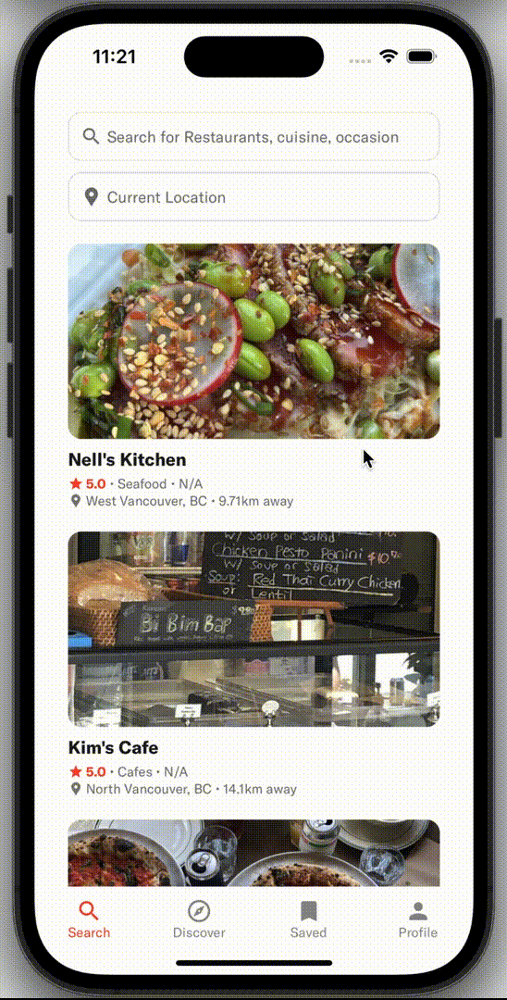

# Table of Contents
+ [About The Project](#abouttheproject)
+ [Gallery](#gallery)
+ [Getting Started](#getting-started)
+ [Contributing](#contributing)

# 💡About The Project
Nom Appetit is a social restaurant tracking and recommendation app designed to answer the age-old question: “So… where do you want to eat?”

Key Features:

1. **Restaurant Tracking:**
Discover and explore a wide range of restaurants through an intuitive search feature. Save your favorite spots to a personal list, create reviews that include ratings and images, and share your experiences with the community by viewing others' reviews.

2. **Smart Recommendations:**
At the heart of Nom Appetit is its intelligent recommendation system. Using item-item collaborative filtering trained on Yelp's dataset, the app offers personalized suggestions, helping you find the perfect place to dine based on your preferences.

With Nom Appetit, finding your next meal becomes a collaborative and enjoyable experience, connecting food lovers and simplifying the decision-making process.

# 📷 Gallery
<div align="center">
  
  <p>Log in, explore restaurants, and share reviews</p>
</div>
<div align="center">
  
  <p>Customize your profile</p>
</div>
<div align="center">
  
  <p>Generate recommendations based on your tastes</p>
</div>

# 🚀 Getting Started
To get a local copy up and running follow these simple example steps.

## Prerequisites

- [Python](https://www.python.org/downloads/)
- [npm](https://www.npmjs.com/)


## API Credentials
- [Firebase](https://firebase.google.com/docs/functions/get-started?gen=2nd)
- [Google Cloud Platform](https://cloud.google.com/)
- [Yelp Fusion API](https://docs.developer.yelp.com/docs/fusion-intro)

## Installation

### Frontend
1. Navigate to the `frontend` folder.
2. Install the required Node.js modules.
```
npm install
```
3. Generate Google Cloud Platform and Firebase credentials, and place them inside a .env file. (Note: You will need to manually add the storageBucket value in firebaseConfig.js.)
5. Configure the server URL for your specific emulator device, and place the credentials inside a .env file.
```
EXPO_PUBLIC_GOOGLE_KEY = (GOOGLE KEY)
API_KEY = (FIREBASE)
AUTH_DOMAIN = (FIREBASE)
PROJECT_ID = (FIREBASE) 
MESSAGING_SENDER_ID = (FIREBASE)
APP_ID = (FIREBASE)
MEASUREMENT_ID = (FIREBASE)
EXPO_PUBLIC_SERVER_URL = (URL)
```
6. Start the application and follow the instructions in the terminal.
```
npx expo start
```

### Backend
1. Navigate to the `backend` folder.
2. Create a `secrets` folder in the `services` folder.
3. Generate & download Firebase Admin SDK private key.
4. Generate Yelp Fusion API key and place it inside a `.env` file.
```
YELP_API = (YELP FUSION KEY)
```
5. Place both the Firebase Admin SDK private key & `.env` file in the `secrets` directory.
6. Install the required Python modules.
```
pip install -r requirements.txt
```
7. Run the server.
```
flask run
```

# 📚 Contributing

Contributions are what make the community such an amazing place to be learn, inspire, and create. Any contributions you make are **greatly appreciated**.

1. Create your Feature Branch (`git checkout -b feature/AmazingFeature`)
2. Commit your Changes (`git commit -m 'Add some AmazingFeature'`)
3. Push to the Branch (`git push origin feature/AmazingFeature`)
4. Open a Pull Request

